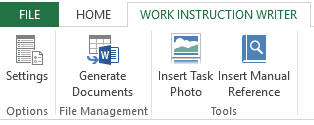

# Work Instruction Writer (WinWriter)

**WinWriter** is an Excel template that can be used to automatically generate Work Instructions as Word documents.

This provides a great separation of concerns by keeping the content of the documents in an easy to manage table-like format while the look and feel of the Work Instruction is controlled via the Word template.

**WinWriter** allows you to maintian a set of work instructions in Excel which can be easily copied, pasted, modified and updated wihtout worrying about the formatting aspects of the final document.

The best way to understand the power of **WinWriter** is to try it out.

## Getting Started

Generating your first documents is easy with the included templates. Just follow these steps:

1) Open the **Work Instruction Writer.xlsm** file.

2) Click on the **Settings** button of the **WORK INSTRUCTION WRITER** tab on the Ribbon.

  

3) On the **Settings** dialogue, ensure you're on the **Word File Options** tab. Point the various folders and word template to the right location in your machine by browsing to them.

  

4) Click the **Save** button and then the **Close** button. You are now ready to generate your first document.

5) Click on the **Generate Documents** button on the Ribbon. Your documents should start being generated.

## Configuration

There are many ways to control the configuration and options that apply to each of the documents generated.

A detailed documentation section is currently under construction and this short tutorial will be updated as soon as that becomes available.

 